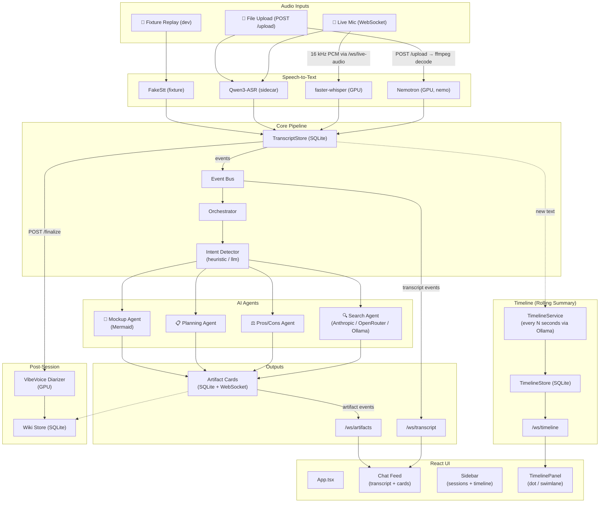

# DeepTalk

Real-time meeting assistant. DeepTalk listens to a discussion, transcribes it via
STT (fake / Nemotron / Whisper / Qwen3-ASR), auto-detects intent, fires AI agents
that produce search answers, pros/cons, plans, and Mermaid diagrams — surfaced as
cards on a live chat-style dashboard.  A background timeline service periodically
summarizes the conversation into topics, decisions, and action items.  Post-session,
speaker diarization (VibeVoice) labels who said what, and a wiki is built.

## Architecture



**Data flow (simplified):** Audio → STT → TranscriptStore → EventBus → both the UI (via WebSocket) and the Orchestrator → Agents → Artifact cards → UI.

A separate TimelineService polls new transcript text, summarizes it via Ollama, merges into a timeline store, and pushes live updates over `/ws/timeline`.

## How it works

### Speech-to-text (STT)

DeepTalk supports four STT backends, all running **locally** — no cloud transcription:

| Backend | Config value | Runtime | Quality | Notes |
|---------|-------------|---------|---------|-------|
| **Fake** | `fake` | CPU | N/A (fixture replay) | Dev/testing only; replays a pre-recorded JSONL fixture |
| **faster-whisper** | `whisper` | CPU (int8) or CUDA (float16) | Excellent (large-v3 is SOTA) | Model sizes: tiny (39M) → large-v3 (1.5B). Runs in-process. Good English + 99 languages. Streaming mode transcribes on silence gaps |
| **Qwen3-ASR** | `qwen` | CUDA only | Good (0.6B) | Runs as a separate sidecar process (scratch/asr_sidecar.py). Sends 2s PCM chunks as WAV files to an OpenAI-compatible HTTP endpoint. Designed for bilingual EN/ZH |
| **Nemotron** | `nemotron` | CUDA (nemo toolkit) | Good (0.6B) | NeMo cache-aware streaming. Not yet validated on real hardware |
| **Parakeet** | `parakeet` | CUDA (nemo toolkit) | SOTA English ASR | NVIDIA Parakeet TDT models (0.6B, 1.1B). Uses the same NeMo streaming pipeline as Nemotron. Pick a model via `DEEPTALK_PARAKEET_MODEL` |

The file source expects a **16 kHz mono 16-bit WAV**. Live mic streams PCM frames at the same format over `/ws/live-audio`.

### Event bus

Two in-process pub/sub buses (`src/deeptalk/bus.py`):

- **Transcript bus** — carries `TranscriptEvent` objects from the STT ingest task to the orchestrator and WebSocket streams
- **Artifact bus** — carries `Artifact` objects from agent results to WebSocket streams

Each bus holds a list of `asyncio.Queue` subscribers. When `publish()` is called, every subscriber gets every event (fan-out). Subscribers filter by `session_id` themselves.

### Orchestrator

A background task (`src/deeptalk/orchestrator.py`) subscribes to the transcript bus and:

1. **Filters** — only `is_final` utterances for the current session
2. **Detects intent** — passes the text to the `IntentDetector`
3. **Deduplicates** — skips if the same `intent.topic` was already processed
4. **Fires the agent** — under a concurrency semaphore (default 3 concurrent)

### Intent detection

Two modes, selected by `DEEPTALK_INTENT`:

| Mode | How it works | Pros | Cons |
|------|-------------|------|------|
| **`llm`** | Sends the text to your search provider (Ollama/Anthropic/OpenRouter) with a prompt asking it to classify as `search`, `debate`, `planning`, `mockup`, or `none`. Parses the JSON response | Accurate, catches nuance | Costs tokens, adds latency |
| **`heuristic`** | Rule-based keyword matching — checks for mockup signals (`"draw the"`, `"wireframe"`), planning signals (`"how do we build"`), debate signals (`" vs "`, `"pros and cons"`), and question leads (`"what"`, `"why"`) | Free, instant, no API call | Less accurate, misses complex intent |

The `llm` mode is now the default. Since a small/mini model (e.g. `llama3.2:3b`) handles classification easily, the overhead is minimal.

### Agents

Each agent follows the same lifecycle:

1. A **pending** artifact is published to the artifact bus (UI shows a skeleton loader card)
2. The agent runs — calls the LLM via `ModelRouter` (which falls through a provider chain: Ollama → Anthropic → OpenRouter)
3. A final artifact (`done` or `error`) with the payload is persisted to the `ArtifactStore` and published to the artifact bus
4. The UI replaces the pending card with the rendered result

| Agent | Intent kind | What it produces |
|-------|-------------|-----------------|
| **Search** | `search` | Answer text + citation links + model name |
| **Pros/Cons** | `debate` | Two-column pros/cons grid + recommendation |
| **Planning** | `planning` | Numbered step list |
| **Mockup** | `mockup` | Mermaid diagram (lazy-loaded) + caption |

### Artifact cards

The React UI subscribes to `/ws/artifacts`. On connect, the server sends the full backlog from `ArtifactStore.all_artifacts()`. Live updates are forwarded from the artifact bus. The `ArtifactCard` component renders different body layouts based on `artifact.agent`.

### Speaker diarization

**Off by default** (`DEEPTALK_DIARIZE=off`). When enabled (`DEEPTALK_DIARIZE=vibevoice`), VibeVoice runs **post-session** on a recorded WAV file (set via `DEEPTALK_RECORDING`). It happens on `POST /finalize` — not in real time. The diarizer assigns speaker labels to transcript segments, which are then stored alongside the transcript events with `source="diarized"`.

Diarization is GPU-only (VibeVoice needs CUDA). If `DEEPTALK_AUDIO=mic` and `DEEPTALK_RECORDING` is set, the live audio is automatically tee'd to the recording WAV as the session runs, so `/finalize` can diarize it without a separate recording step.

**Limitation:** VibeVoice segments speech into non-overlapping chunks per speaker. It cannot separate truly overlapped speech (two people talking simultaneously) — that requires source separation (e.g. a model like SepFormer) which is not currently implemented.

### Timeline (rolling summarization)

A background `TimelineService` (`src/deeptalk/timeline/service.py`) runs every `DEEPTALK_TIMELINE_INTERVAL` seconds. It:

1. Pulls new transcript text from `TranscriptStore`
2. Sends it to Ollama with a prompt that includes existing topics (for merge/update)
3. Parses the JSON response into topic entries with summaries, decisions, and action items
4. Merges into `TimelineStore` — if the same `topic_id` re-emerges, `end_ts` is extended and summary/data replaced
5. Publishes the updated snapshot over `/ws/timeline`

The UI renders two views: **Dots** (vertical timeline) and **Swimlane** (horizontal bars). Clicking an entry scrolls the transcript feed to that timestamp.

## Current state

Everything below works end-to-end on a developer machine (fake STT, fake agents) and on a GPU laptop (real STT, real agents, diarization).

### What's implemented (all phases 1–9)

| Area | Status | Notes |
|------|--------|-------|
| **Transcript spine** (SQLite append-only store + WebSocket push) | ✅ | Source of truth; dedup by span_id |
| **Live STT** — fake, Nemotron (nemo), faster-whisper, Qwen3-ASR | ✅ | Qwen is a separate sidecar process |
| **Live mic streaming** — AudioWorkletNode → /ws/live-audio WebSocket | ✅ | 16 kHz PCM; also works with file upload |
| **Model router** — Anthropic Claude, OpenRouter (Gemini), Ollama (local) | ✅ | Pick via `DEEPTALK_SEARCH_PROVIDER` |
| **Intent detector** — heuristic (free) or LLM-powered | ✅ | |
| **Orchestrator** — routes detected intents to agents | ✅ | Concurrency limit, cost tracking, timeout |
| **Search agent** — web search + answer with citations | ✅ | |
| **Pros/Cons agent** — extracts pros, cons, recommendation | ✅ | |
| **Planning agent** — generates step-by-step plans | ✅ | |
| **Mockup agent** — generates Mermaid diagrams via `enable_mockup` flag | ✅ | Lazy-loads mermaid in the UI |
| **Session wiki** — topics, decisions, action items (post-finalize) | ✅ | |
| **Speaker diarization** — VibeVoice (post-session) | ✅ | GPU-only; auto-records when `DEEPTALK_RECORDING` is set |
| **Timeline (rolling summarization)** — background Ollama service | ✅ | Merges topics by (session, topic_id); dot + swimlane views |
| **Session management** — create, switch, rename, delete sessions | ✅ | localStorage + SQLite per-session isolation |
| **Chat-style UI** — transcript bubbles, user messages, artifact cards | ✅ | New sidebar layout, mobile overlay |
| **Audio file upload** — mp3/m4a/wav → ffmpeg decode → STT | ✅ | |
| **GPU lease** — VRAM reservation, concurrent-STT guard | ✅ | |
| **Cost/timeout hardening** — max agent calls, per-agent timeout | ✅ | |

### In development / on deck

- End-to-end Nemotron validation on real GPU hardware (NeMo API tuning)
- Export / share session transcripts
- Real-time speaker identification (not just post-session diarization)

## Quickstart

```bash
# Requires: Python 3.12+, Node.js 18+, uv
uv sync
cd ui && npm install && npm run build && cd ..
DEEPTALK_STT=fake uv run python -m deeptalk.server
# open http://127.0.0.1:8000/
```

> **Seeing `{"detail":"Not Found"}` at `/`?** You skipped `npm run build`. The API works — check `curl http://127.0.0.1:8000/health`.

### Real agents (any machine + API key)

```bash
export ANTHROPIC_API_KEY=sk-ant-...
DEEPTALK_SEARCH_PROVIDER=anthropic uv run python -m deeptalk.server
```

Or with a local Ollama model:

```bash
DEEPTALK_SEARCH_PROVIDER=ollama DEEPTALK_OLLAMA_MODEL=llama3.2:3b uv run python -m deeptalk.server
```

### GPU + real STT (Linux / WSL2)

```bash
uv sync --extra gpu
cd ui && npm install && npm run build && cd ..

# Whisper (faster-whisper)
DEEPTALK_STT=whisper DEEPTALK_AUDIO_FILE=/path/16k_mono.wav uv run python -m deeptalk.server

# Qwen3-ASR sidecar
qwen-asr-serve Qwen/Qwen3-ASR-0.6B --host 127.0.0.1 --port 8010
DEEPTALK_STT=qwen DEEPTALK_AUDIO_FILE=/path/16k_mono.wav uv run python -m deeptalk.server
```

### Timeline (rolling summarization via Ollama)

```bash
# Requires Ollama running on localhost:11434 with a model loaded (e.g. llama3.2:3b)
DEEPTALK_TIMELINE_INTERVAL=45 uv run python -m deeptalk.server
```

Set `DEEPTALK_TIMELINE_INTERVAL=0` to disable. The timeline appears in the sidebar — toggle between **Dots** and **Swimlane** views. Click an entry to jump to that moment in the transcript.

### Distributed setup (Mac + GPU laptop)

DeepTalk's remote dependencies are just HTTP endpoints — you can run the server on a Mac while the heavy inference runs on a separate GPU laptop:

```
Mac (client)                  GPU Laptop (server)
─────────                     ──────────────────
DeepTalk server ────────────→ Qwen3-ASR sidecar (:8010)
  (orchestrator, agents,      Ollama (:11434)
   UI, audio file)
  ↑
Browser (localhost:8000)
```

**On the GPU laptop:**
```bash
# Start Qwen3-ASR sidecar
uv run python scratch/asr_sidecar.py

# Start Ollama (if not already running)
ollama serve
```

**On the Mac:**
```bash
DEEPTALK_STT=qwen \
DEEPTALK_QWEN_ASR_URL=http://GPU_LAPTOP_IP:8010/v1/audio/transcriptions \
DEEPTALK_SEARCH_PROVIDER=ollama \
DEEPTALK_OLLAMA_URL=http://GPU_LAPTOP_IP:11434 \
DEEPTALK_AUDIO=file \
DEEPTALK_AUDIO_FILE=/path/to/meeting.wav \
uv run python -m deeptalk.server
```

Only the 2-second PCM chunks (~64 KB each) travel over the network to the GPU laptop's Qwen sidecar. The browser, audio file, and WebSocket connections all stay local to the Mac. For live mic, the mic audio is captured on the Mac and only the chunks are sent remotely.

### Live mic (Linux desktop, not WSL)

```bash
DEEPTALK_STT=whisper DEEPTALK_AUDIO=mic uv run python -m deeptalk.server
# Click the 🎤 button in the input bar to start streaming
```

### Diarization + wiki

```bash
DEEPTALK_DIARIZE=vibevoice DEEPTALK_RECORDING=/path/meeting.wav uv run python -m deeptalk.server
# In the UI, click "Build wiki" — or:
curl -X POST localhost:8000/finalize -H 'content-type: application/json' -d '{"session_id":"demo"}'
```

## Endpoints

| Endpoint | Purpose |
|----------|---------|
| `GET /health` | Liveness |
| `GET /` | UI (after `npm run build`) |
| `WS /ws/transcript?session_id=` | Live transcript stream |
| `WS /ws/artifacts?session_id=` | Live agent card stream |
| `WS /ws/live-audio?session_id=` | Accepts 16 kHz PCM binary frames for live STT |
| `WS /ws/timeline?session_id=` | Live timeline entry stream |
| `POST /ask` `{session_id, query}` | Run the search agent manually |
| `POST /upload` `{session_id, file}` | Upload audio for transcription |
| `POST /finalize` `{session_id}` | Build wiki (+ diarize if configured) |
| `POST /clear` `{session_id}` | Clear session data |
| `GET /wiki?session_id=` | Get the session wiki |

## Configuration (environment variables)

| Variable | Default | Meaning |
|----------|---------|---------|
| `DEEPTALK_STT` | `fake` | `fake`, `whisper` (faster-whisper), `qwen` (Qwen3-ASR sidecar), `nemotron`, `parakeet` |
| `DEEPTALK_WHISPER_MODEL` | `base` | faster-whisper model size |
| `DEEPTALK_AUDIO` | `file` | `file` or `mic` |
| `DEEPTALK_AUDIO_FILE` | — | Path to 16 kHz mono WAV |
| `DEEPTALK_QWEN_ASR_URL` | `http://127.0.0.1:8010/v1/audio/transcriptions` | Qwen3-ASR endpoint |
| `DEEPTALK_QWEN_ASR_MODEL` | `Qwen/Qwen3-ASR-0.6B` | Qwen3-ASR model name |
| `DEEPTALK_QWEN_ASR_CHUNK_MS` | `2000` | PCM window for live Qwen |
| `DEEPTALK_SEARCH_PROVIDER` | `fake` | `fake`, `anthropic`, `openrouter`, `ollama` |
| `DEEPTALK_OLLAMA_URL` | `http://localhost:11434` | Ollama server URL |
| `DEEPTALK_OLLAMA_MODEL` | `llama3.2:3b` | Ollama model name |
| `DEEPTALK_TIMELINE_INTERVAL` | `45` | Seconds between timeline summarizations (`0` = off) |
| `DEEPTALK_ANTHROPIC_MODEL` | `claude-sonnet-4-6` | Claude model name |
| `DEEPTALK_OPENROUTER_MODEL` | `google/gemini-2.5-flash` | OpenRouter model |
| `DEEPTALK_INTENT` | `llm` | `llm` (uses search provider) or `heuristic` (keyword rules) |
| `DEEPTALK_DIARIZE` | `off` | `off` or `vibevoice` |
| `DEEPTALK_RECORDING` | — | WAV path for recording + diarization |
| `DEEPTALK_MAX_AGENT_CALLS` | `50` | Per-session agent cap (`-1` = unlimited) |
| `DEEPTALK_AGENT_TIMEOUT` | `30` | Per-agent timeout (seconds) |
| `DEEPTALK_SESSION_ID` | `demo` | Current session ID |
| `DEEPTALK_DB` | `deeptalk-demo.db` | SQLite path |
| `DEEPTALK_FIXTURE` | bundled | Fixture path (when STT=fake) |
| `DEEPTALK_HOST` / `DEEPTALK_PORT` | `127.0.0.1` / `8000` | Bind address |
| `ANTHROPIC_API_KEY` | — | Required for Anthropic provider |
| `OPENROUTER_API_KEY` | — | Required for OpenRouter provider |

## UI dev mode

```bash
cd ui
VITE_WS_BASE=ws://127.0.0.1:8000 npm run dev   # Vite on :5173
# Python server on :8000
```

## Tests

```bash
uv run pytest -q     # Python backend
cd ui && npm test    # UI (Vitest)
```

## Known gaps

- **Nemotron** STT is wired but not validated on real GPU hardware — will need NeMo API / chunk-size tuning on first run.
- **Live mic** is unavailable in WSL2 (no default audio input device).
- **Timeline** requires a local Ollama instance — no remote LLM fallback yet.
